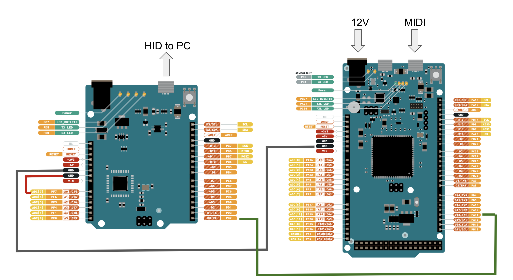

# Arduino-MIDI-to-HID
Convert MIDI signal to HID (Joystick) -- for MSFS 2020 and flight simulation in general

Warning -- do NOT connect Leonardo's TX to Due's RX. Due works on 3.3V while Leonardo works on 5V. 5V TTL COULD burn your Due board.

